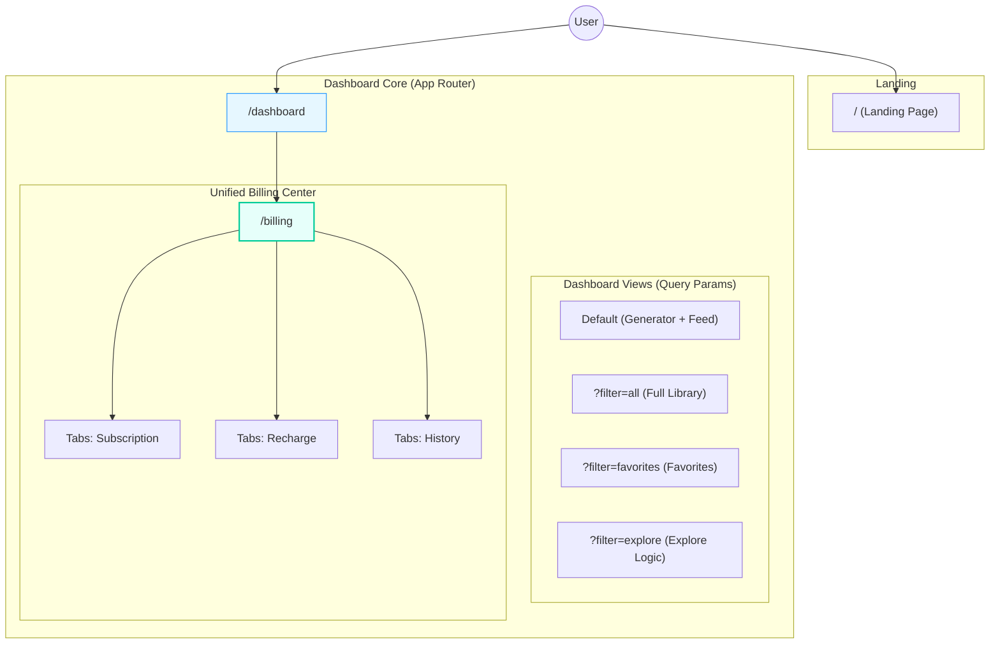

# SunoFlow 架构分析与重构记录

本文档记录了 SunoFlow 应用从分散架构向统一、现代化架构演进的过程，重点包括路由整合、移动端适配方案及性能优化措施。

## 1. 架构演进 (Architecture Evolution)

### 1.1 重构前状态 (Before)

* **路由分散**：`recharge` (充值)、`membership` (会员)、`transactions` (交易)、`explore` (探索) 均为独立顶级路由，导致用户体验割裂。
* **冗余目录**：存在 `app/account` (无效重定向)、`app/ui-demo` 等废弃代码。
* **PC 优先**：布局仅针对桌面端优化，移动端不可用。

### 1.2 重构后状态 (After)

## 2. 核心改进措施 (Key Improvements)

### 2.1 路由与架构整合

1. **财务中心统一 (`/billing`)**：
    * 将原有的三个分散页面整合为单一入口。
    * 使用 Tabs 组件无缝切换“会员订阅”、“积分充值”和“交易记录”。
    * **收益**：减少页面跳转，提升用户管理资产的效率。

2. **Dashboard 视图化**：
    * 将 `Explore` 功能降级为 `components/music/explore-view.tsx` 组件。
    * 通过 URL 参数 `/dashboard?filter=explore` 动态加载，使其成为 Dashboard 的一部分。
    * **收益**：保持 Sidebar 导航上下文不丢失，体验更流畅。

### 2.2 移动端适配 (Mobile Responsiveness)

1. **MobileNav 组件**：
    * 新增 `components/layout/mobile-nav.tsx`。
    * 引入 **Sheet (抽屉)** 交互模式，点击汉堡菜单从左侧滑出导航。
2. **响应式布局**：
    * **Dashboard**：`flex-row` (桌面) -> `flex-col` (移动)。
    * **Generator**：在移动端自动调整为垂直堆叠，并限制高度以避免占据全屏。
    * **Header**：移除 sticky 定位，避免移动端视口遮挡。

### 2.3 UI/UX 细节打磨

1. **高级空状态 (`EmptyState`)**：
    * 提取了通用的 `EmptyState` 组件，包含微动效、渐变背景和图标支持。
    * 彻底消灭了全站的“纯文本提示”，所有无数据场景现在都拥有品牌感一致的视觉反馈。
2. **加载体验 (`LoadingSpinner`)**：
    * 标准化 `LoadingSpinner` 和 `LoadingPage`。
    * 利用 Next.js `loading.tsx` 实现路由级别的平滑过渡。

### 2.4 性能优化 (Performance)

1. **Next.js Image 优化**：
    * 全站替换 `` 标签为 `next/image`。
    * 配置 `sizes` 属性，确保在移动端加载小尺寸图片，显著减少 LCP 时间。
    * 开启 Lazy Loading，节省带宽。

## 3. 下一步建议 (Next Steps)

1. **深色模式 (Dark Mode)**：目前 CSS 变量主要针对浅色优化，建议后续进行全站 Dark Mode 适配测试。
2. **SEO 增强**：虽然已添加基础 Metadata，可进一步为每个子页面（如生成的歌曲详情页）添加动态 Open Graph 预览。
3. **错误监控**：集成 Sentry 或类似工具，监控生产环境的运行时错误。

## 4. 近期更新日志 (Recent Updates - Brand & Legal Polish)

### 2024-12-13 品牌与法律合规性升级

1. **落地页 (Landing Page) 完善**：
    * **内容增强**：新增 FAQ (常见问题) 和 CTA (行动号召) 板块，补全了落地页的营销闭环。
    * **展示优化**：改进了 Testimony 区域的视觉布局；使用“光效”增强了 CTA 区域的吸引力。

2. **品牌标识 (Brand Identity) 统一**：
    * **Asset 替换**：全站原本通用的 Sparkles 图标已全面替换为正式的品牌 Logo (`/public/logo.png`)。
    * **覆盖范围**：包括 Landing Page 导航/页脚、Dashboard 侧边栏、移动端菜单以及浏览器 Favicon。

3. **法律合规 (Legal Compliance)**：
    * **专用页面**：发布了设计精美的 `Privacy Policy` (隐私政策) 和 `Terms of Service` (服务条款) 页面。
    * **视觉升级**：摒弃了纯文本样式，采用卡片式布局、专业排版 (`Typography`) 和清晰的信息层级，提升了品牌信任度。

4. **交互体验优化 (UX)**：
    * **语言切换**：重构了 `LanguageSwitcher` 组件，弃用繁琐的下拉菜单，改为高效的“点按即切换”模式。
    * **入口优化**：移除了侧边栏底部的冗余切换入口，将其统一放置在 Dashboard 和 Billing 页面的 Header 右上角，操作路径更顺手。
